# ☕ Instant Coffee

An instant diagram generator using Mermaid and Ollama.


## Overview

Instant Coffee translates natural language descriptions into Mermaid diagrams using a local LLM. Describe what you want in plain English, and the application renders it as an SVG diagram.

## Getting Started

```bash
npm install
npm run dev
```

Open http://localhost:5173 in your browser.

### Prerequisites

- [Ollama](https://ollama.com/) running locally with a model installed

#### Installing Ollama

1. Download and install Ollama from [ollama.com](https://ollama.com/)
2. Pull the required model:

```bash
ollama pull gpt-oss:20b
```

3. Start Ollama:

```bash
ollama serve
```

The model will be used automatically by the application.

## Features

- Natural language to diagram conversion via Ollama
- Real-time SVG rendering with Mermaid (client-side)
- Source code editor for manual Mermaid tweaks
- Undo/Redo support (Ctrl+Z / Ctrl+Shift+Z)
- Export to SVG and PNG
- **Persistent Memory**: The AI remembers context across sessions
  - Automatically learns facts from conversations (services, teams, preferences, etc.)
  - Manual memory management with add/edit/delete controls
  - AI-powered memory consolidation to remove duplicates and contradictions
  - All memories stored locally in your browser (IndexedDB)

## How It Works

```mermaid
%%{init: {'theme': 'base', 'themeVariables': {'primaryColor': '#a855f7', 'primaryTextColor': '#fff', 'primaryBorderColor': '#a855f7', 'lineColor': '#6b7280', 'secondaryColor': '#6366f1', 'tertiaryColor': '#f3f4f6'}}}%%
flowchart TD
    Start([🚀 Start]) --> Idea[💡 Enter your idea]
    
    Idea --> Generate[✨ AI generates diagram]
    Generate --> Whiteboard[📋 Diagram on whiteboard]
    
    Whiteboard --> Choice{What's next?}
    
    Choice --> Changes[🔄 Request changes]
    Changes --> Generate
    
    Choice --> Questions[💬 Ask questions]
    Questions --> Answer[💭 AI answers]
    Answer --> Choice
    
    Choice --> Done[✅ Finished?]
    Done --> Export{How to save?}
    
    Export --> PNG[🖼️ Export as PNG]
    Export --> SVG[📐 Export as SVG]
    Export --> Code[📄 Copy mermaid code]
    
    PNG --> End([💜 Done!])
    SVG --> End
    Code --> End
```



## Tech Stack

- **Frontend**: React 18, TypeScript, Vite, Tailwind CSS
- **Diagram Engine**: Mermaid.js (client-side)
- **AI**: Ollama
- **Storage**: Dexie.js (IndexedDB wrapper) for persistent memories

## Project Structure

```
src/
├── components/     # React components (ChatPanel, WhiteboardPanel, MemoryPanel)
├── lib/           # Mermaid, Ollama, and memory utilities
├── hooks/         # Custom React hooks (useChat, useMemories)
├── types/         # TypeScript types
├── db/            # Dexie database and memory operations
```

## Memory System

The application includes a persistent memory system that helps the AI remember information across sessions:

### How It Works

1. **Automatic Learning**: As you chat, the AI automatically saves important facts using the `save_memory`, `update_memory`, and `delete_memory` tools
2. **Context Injection**: Saved memories are injected into every AI request as "USER'S CONTEXT"
3. **Manual Management**: Use the Memory Panel to view, add, edit, or delete memories manually
4. **Consolidation**: Click "Cleanup" to use AI to deduplicate and consolidate memories

### Memory Features

- **Atomic Storage**: Each memory is a single, self-contained fact
- **Local First**: All data stored in your browser using IndexedDB (nothing sent to external servers)
- **Smart Updates**: The AI can update existing memories when new information contradicts old facts
- **Toggleable**: Disable memory reading or saving via the settings menu if desired

## License

MIT
